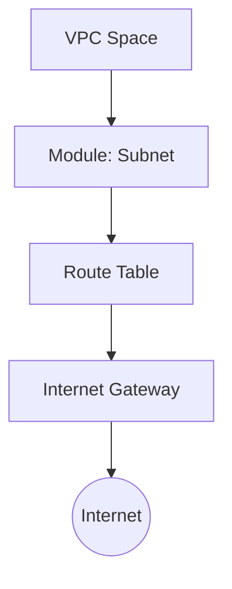

# 🛡️ Hyrule Infrastructure: Network Subnet Module

[](https://www.terraform.io/)
[](https://registry.terraform.io/providers/hashicorp/aws/latest)
[](https://localstack.cloud/)

## 📖 Description
This is an **atomic module** designed to provision public subnets with full Internet connectivity. It serves as a foundational building block for the Hyrule architecture, ensuring consistent deployments across **AWS Cloud** and local emulators (**LocalStack**).

### Infrastructure Stack
When invoked, this module deploys the following resources:
* **Subnet:** An isolated network segment.
* **Internet Gateway (IGW):** The communication bridge to the outside world.
* **Route Table:** Custom routing logic for traffic control.
* **Route Association:** Logical binding between the subnet and its internet egress.

---

## 🏗️ Architecture Overview


---

## 📁 Project Structure
```text
modules/
└── subnet/
    ├── main.tf      # Resource logic (IGW, RT, Subnet)
    ├── variables.tf # Input parameters
    └── outputs.tf   # Exported data (Return values)
```

---

## 🔧 Module Interface (Inputs/Outputs)

### 📥 Input Variables
| Variable | Type | Required | Description |
| :--- | :---: | :---: | :--- |
| `vpc_id` | `string` | ✅ | The ID of the VPC where the subnet will reside. |
| `subneta_cidr` | `string` | ✅ | CIDR block for the subnet (e.g., `10.12.1.0/24`). |
| `availability_zone`| `string` | ✅ | Target AWS AZ (e.g., `us-east-1a`). |
| `subneta_name` | `string` | ✅ | Prefix for resource tagging and identification. |

### 📤 Output Values
| Name | Description |
| :--- | :--- |
| `subnet_id` | Unique identifier for the created subnet. |
| `route_table_id` | ID of the associated Route Table. |

---

## 🚀 Quick Implementation

Integrate this module into your root `main.tf` as follows:

```hcl
module "network_dev" {
  source = "./modules/subnet"

  vpc_id            = aws_vpc.main.id
  subneta_cidr      = "10.0.1.0/24"
  availability_zone = "us-east-1a"
  subneta_name      = "hyrule-dev-public"
}
```

---

## 🧪 Local Lab (LocalStack)
This module is optimized for local development cycles. To prevent state collisions or "ghost" resources:

1.  **Provider Configuration:**
    Ensure your EC2 endpoint points to `http://localhost:4566`.
   
2.  **Clean Lifecycle:**
    If you make deep structural changes, reset your environment:
    ```bash
    docker compose down && docker compose up -d
    terraform init -reconfigure
    ```

